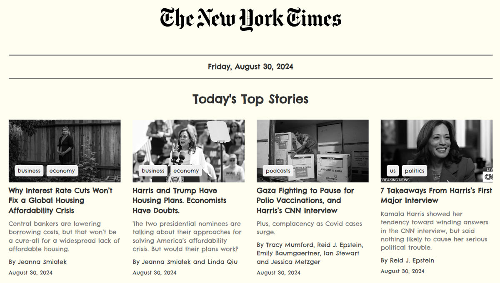

# The New York Times News App



This project is a React-based web application that displays the latest news articles using The New York Times API. The application is built with a focus on simplicity, responsiveness, and a clean UI.

## Features

- Fetches and displays the latest news articles from The New York Times.
- Responsive design that adapts to various screen sizes.
- Pagination to navigate through multiple pages of articles.
- Smooth animations when loading articles.

## Getting Started

### Prerequisites

- Node.js and npm installed on your machine.
- A New York Times API key, which you can obtain from [NY Times Developer Portal](https://developer.nytimes.com/apis).

### Installation

1. Clone the repository:

```bash
    git clone https://github.com/yourusername/the-new-york-times-app.git
    cd the-new-york-times-app
```

2. Install dependencies for both client and server:

```bash
    cd client
    npm install
    npm install react-transition-group
    cd ../server
    npm install
```

3. Create a .env file in the server directory and add your New York Times API key:

```bash
    NYT_API_KEY=your_api_key_here
```

### Running the Application

1. Start the server:

```bash
    cd server
    npm start
```

2. Start the client:

```bash
    cd ../client
    npm start
```

3. Open your browser and navigate to http://localhost:3000 to view the application.

## Live Demo

Check out the live demo of the application [here](https://nyt-news-daily.vercel.app/).

## License

This project is licensed under the MIT License - see the [MIT License](https://opensource.org/license/MIT) for details.
